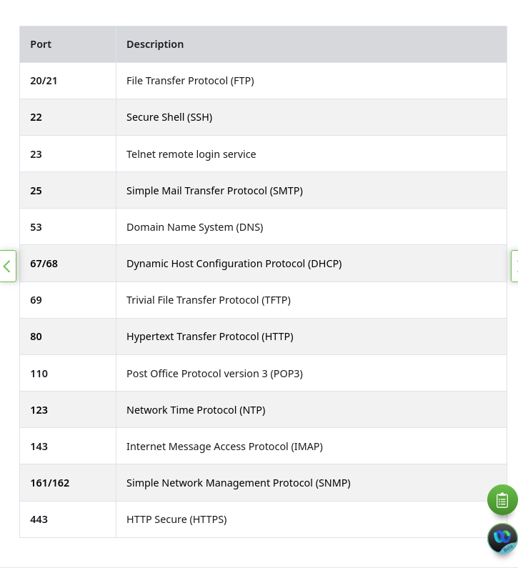

windows boot process 
service pack
domains

## Linux 
Squil
SIEM 
Ticketing Sytems
Packet Generators
proof-of-concept exploits PoC
Terminator, eterm, xterm, konsole, and gnome-terminal.

chown
dd
ps
ifconfig
iwconfig
passwd
CTRL+O save 
CTRL+W opens serch meny
CTRL+G
SciTE
Well knows ports 

Common options in configuration files are port number, location of the hosted resources, and client authorization details
snort
In Linux, log files can be categorized as:
- Application logs
- Event logs
- Service logs
- System logs
System Security Services Daemon (SSSD) manages remote access and authentication for single sign-on capabilities (SSO).

/val/log/messages or syslog
/var/log/secure or auth.log
/var/log/boot.log
/var/log/kern.log
/var/log/cron 
/var/log/mysql.log
/var/log/dmesg

ext3 32TB
NFS -> open standart
CDFS
Swap File System (Swap space)
HFS+ (Apple macintosh)
APFS - strong encryption (optimized for flash ans solid-state drives)
MBR
mount -> assing directory to partition

hard link -> inode

ln    := hard link
ln -s := symbolic link

Although symbolic links have a single point of failure (the underlying file), symbolic links have several benefits over hard links:
- Locating hard links is more difficult. Symbolic links show the location of the original file in the ls -l command, as shown in the last line of output in the previous command output (mytest.txt -> test.txt).
- links are limited to the file system in which they are created. Symbolic links can link to a file in another file system.
- links cannot link to a directory because the system itself uses hard links to define the hierarchy of the directory structure. However, symbolic links can link to directories.
You're right. Let's revisit the three listed differences between hard links and symbolic links and explain *why* they behave that way, using the inode/filesystem representation we discussed.
1. "Locating hard links is more difficult."
*   **The Inode Explanation:** Hard links share the **same inode**. They are two different names for the same file structure. Because they are peer entries, the filesystem has no concept of an "original" file and a "link." To the system, both file names are equally valid pointers to the data.
*   **The Consequence:** The `ls -l` command, which reads file metadata, cannot look at the inode and say, "This file has another name pointing to it over in directory X." It has no way of knowing *all* the directory entries (filenames) that point to that inode without scanning the **entire filesystem**.
*   **Symbolic Link Contrast:** A symbolic link has its **own separate inode** and the **path to the original file is stored as the link's data**. `ls -l` simply displays the data content of the symbolic link's inode, which is the target's path (e.g., `mytest.txt -> test.txt`).s
2. "Hard links are limited to the file system in which they are created. Symbolic links can link to a file in another file system."
*   **The Inode Explanation:** An inode number is a unique identifier *within a single filesystem*.
    *   Filesystem A has its own block of inode numbers (e.g., 1 to 1,000,000).
    *   Filesystem B has its own block of inode numbers (e.g., 1 to 1,000,000).
    *   Inode #100 on Filesystem A is completely different from Inode #100 on Filesystem B.
*   **The Consequence (Hard Links):** Because a hard link must point to an **inode number**, that number is only meaningful on the specific filesystem where it exists. It is impossible for a directory entry on Filesystem A to point to an inode number on Filesystem B.
*   **Symbolic Link Contrast:** A symbolic link stores a **path (a text string)** as its data (e.g., `/mnt/other_disk/file.txt`). A path is meaningful across all mounted filesystems. When the system follows the link, it simply reads the path string and attempts to resolve it, which is an operation that works globally.
3. "Hard links cannot link to a directory..."
*   **The Inode Explanation:** Every directory *already* uses hard links to define the file system hierarchy.
    *   Every directory has a hard link entry named `.` (dot) which points to its own inode.
    *   Every subdirectory has a hard link entry named `..` (dot-dot) which points to the inode of its parent directory.
*   **The Consequence (Creating a new Hard Link to a Directory):** If the system allowed you to create an arbitrary hard link to a directory (say, `myDirLink` pointing to `OriginalDir`), it would break the carefully constructed directory structure rules (`.` and `..`). It would create a **loop** in the filesystem hierarchy. Tools that traverse the filesystem (like `tar`, `find`, or even system security checkers) would get stuck in an infinite loop, crashing the system or making it unmanageable.
*   **Symbolic Link Contrast:** A symbolic link is just a redirection. It doesn't use the directory's inode or change the link count. It's just a text file containing the directory's path. When a tool follows a symbolic link to a directory, it knows it's a redirection and handles it appropriately, preventing recursive loops.
Dash Search Box
Software updater
Listing does note require user previlages [killing, modifiying] yes
ps top
rootkits: Granting Privileged Access, Hiding its Presence
**Secure a Backdoor**:= efers to the rootkit's role in ensuring the attacker has persistent, hidden, and undetectable access to the compromised system.
Inspection methods 
- include behavioral-based methods, 
- signature scanning, 
- difference scanning = like chekcing the hashes (aintegrity checking or baseline analysis) 
- and memory dump analysis.
firmware rootkits
chkrootkit uses strings and grep
/proc/  := virtual file ssytem with virtual files
/proc/kmsg
Security Onion -> netowrk security monitoring
Kali linux -> netwrok security penetration testing
hardening device

sudo updatedb 
locate file

## Network protocols
SOHO
bring your own device” (BYOD) program
message encoding, formatting, encapsulation, size, timing, and delivery options.
Open standard protocol suite vs Standards-based protocol suite
ICMPv6 ND - ICMPv6 Neighbor Discovery. Includes four protocol messages that are used for address resolution and duplicate address detection.
EIGRP 
flow control 
response timeout 
access method

session + presentation + application
netowrk -> internet
data link + physical = network access
OSI 
what must be done at a particular layer, 
but not prescribing how it should be accomplished.

applcaiton  -> process - to process comunication
presntation -> what encoding 
sessoi -> organize dialkog and mangae dat exchange (dialog control)
tcp -> segment, transfer, reasemble
netowrk -> identifed end devices
data link -> common media

he TCP/IP model is a protocol model because it describes the functions that occur at each layer of protocols within the TCP/IP suite
speed vs efficiency

TCP Segment UPD PDU datagramm 
IP packet or datagram 
Ethernet Frame
pyhical bits

OSI takes PDU as data

Ethernet IEEE 802.2 802.3
LLC - Logical link control 802.2 
MAC + physcial 802.3

MTU 

In some cases, an intermediate device, usually a router, must split up an IPv4 packet when forwarding it from one medium to another medium with a smaller MTU. This process is called fragmenting the packet, or fragmentation. Fragmentation causes latency. IPv6 packets cannot be fragmented by the router.
MTU 
Fragmentation

RFC 790
RFC 1918

In IPv4, the host receives the IPv4 address of the default gateway either dynamically from Dynamic Host Configuration Protocol (DHCP) or configured manually. In IPv6, the router advertises the default gateway address or the host can be configured manually.
route print or netstat -r c

Private:
10.0.0.0 /8 or 10.0.0.0 to 10.255.255.255
172.16.0.0 /12 or 172.16.0.0 to 172.31.255.255
192.168.0.0 /16 or 192.168.0.0 to 192.168.255.255
Loopback:
127.0.0.0 /8 

Interface ID = host portion 64 bits becaues of slaac

