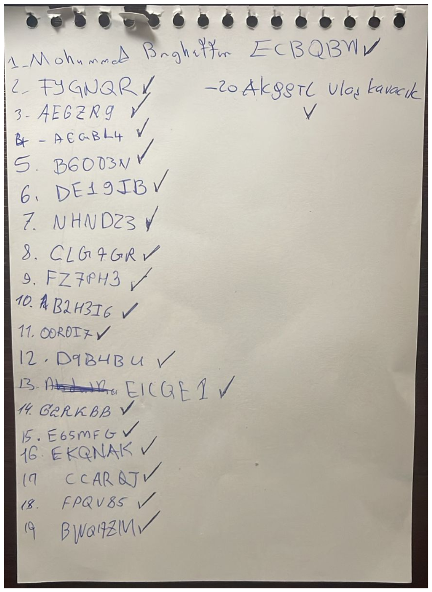
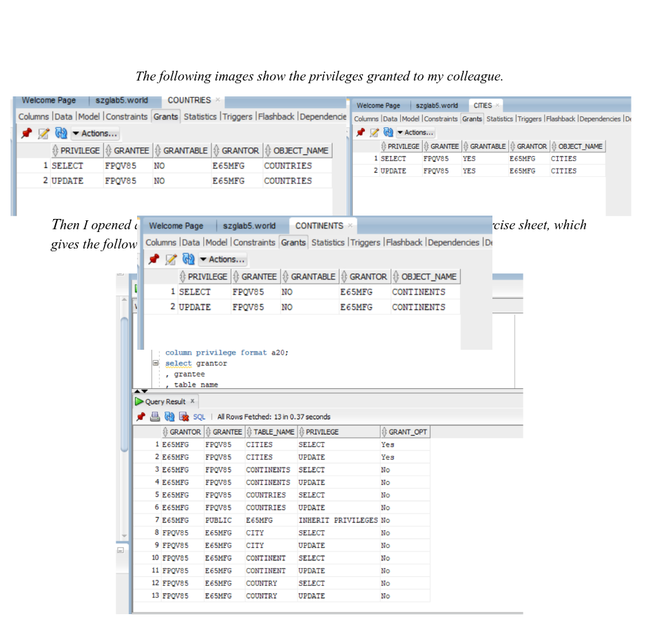
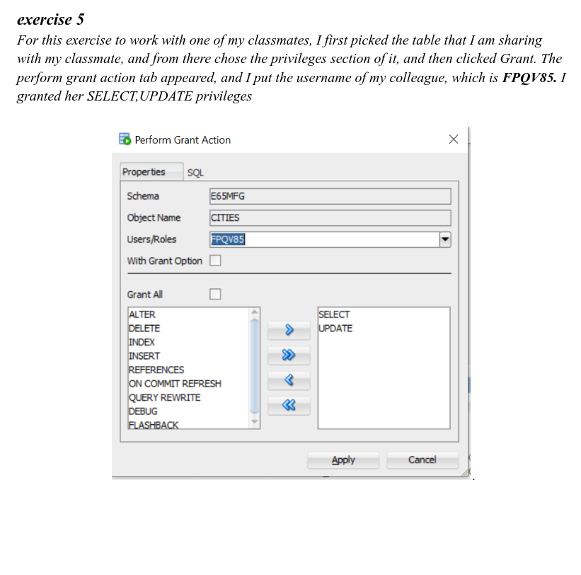

# Report

## Student Submissions Problems

### Lab 1 - Oracle
- **Jargalsaikhan Tserenlkham**
    - Problem: The student granted one of the **privileges** with `GRANT OPTION`. I included her solution for exercise 5 at the end of the report.
    For the tables **`countries`** and `continents`, she granted the
    privileges without `GRANT OPTION`, but for `cities` she gave `GRANT OPTION`. This exercise was 1.5p and the student got 0p/1.5p.
    Apparently, even if she grants just one of privileges with `GRANT OPTION`,
    **all** the points will be removed. The student needs **only 0.5** points to
    get a 4.
    - Points: 4.5p (0.5p to get a 4)
    - Grading: 2: 3<; 3: 4<=; 4: 5<=; 5: 6<=
    - Why do I think she deserves the chance?
        - She did all the **other tables** right, and she *only* needs 0.5 to
        get a better grade.
        - She got a 5 in `lab 2` and `lab 3`, and she works hard in my lab.

### Lab 2 - SQL 1
- **Arzumanov Mikhail**:
    - Problem: Uploaded format in `docx` instead of `pdf`.
    - Why do I think he deserves the chance?
        - If he didn't upload in `docx`, he would get a grade of 5.
        - He also got a five in the `lab 3` and works hard in my lab.

## General Problem
In the `lab 2`, there were people who left the lab without me paying
attention or asking me. I noticed some empty chairs so i got suspicious. 
Therfore, at the end of the lab, I asked the
students to sign on a piece of paper with their Neptun codes.
After that, I found out that:

- **Hlabangwana Lenard Tivanani** (GYKM9W) **has uploaded** the lab but has not participated **until** the end.

I do not tolerate this kind of behavior. I give students in my
lab more freedom so they can feel comfortable. I am not the police.
But the moment it is misused, that is **intolerable**.

{height=30%}

