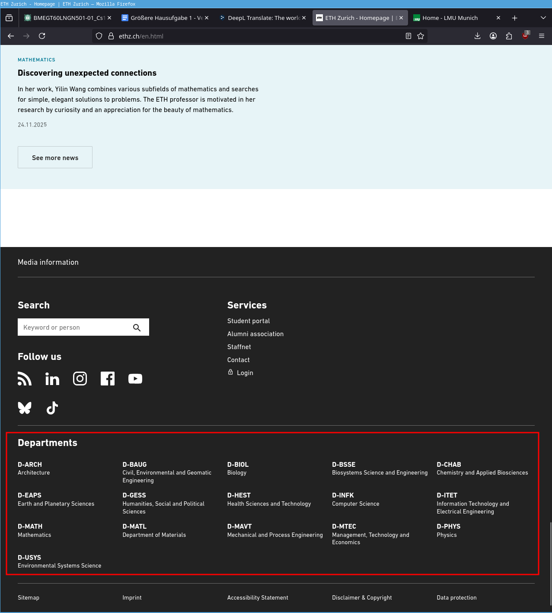
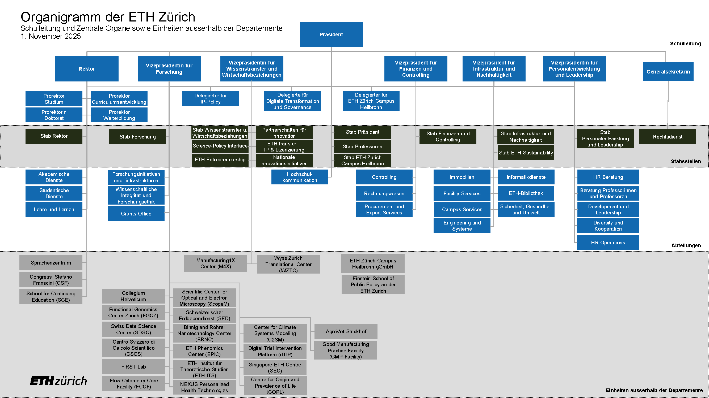
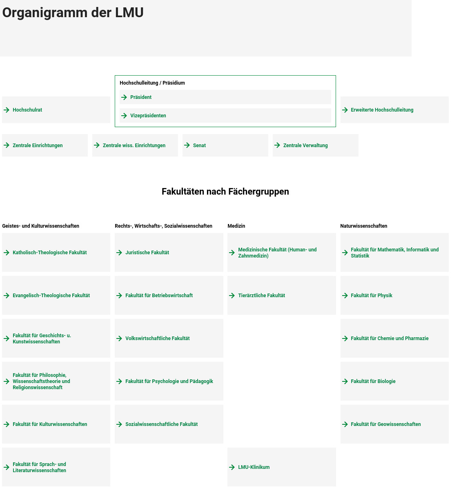

## **Größere Hausaufgabe 1. Vergleich deutschsprachiger Universitäten (Arbeitsblatt)**

Besuchen Sie die Webseiten von **zwei deutschsprachigen Universitäten** (z. B.
in Deutschland, Österreich und der Schweiz). Vergleichen Sie die Universitäten
anhand der folgenden Leitfragen und notieren Sie eure Beobachtungen und
Eindrücke.

**Teil 1: Grundlegende Informationen**

*- Wie heißen die zwei Universitäten? In welchem Land und in welcher Stadt liegen sie?*

Die zwei Universitäten heißen:

1. ETH Zürich (Eidgenössische Technische Hochschule Zürich)
2. LMU (Ludwig-Maximilians-Universität München)

Die erste Universität liegt in der Schweiz, in Zürich, während die zweite in Deutschland, in der bayerischen Region liegt.

*- Wann wurden sie gegründet?*

Die ETH Zürich wurde 1854 gegründet, während die LMU 1472 gegründet wurde.

*- Wie viele Studierende sind eingeschrieben (ungefähr)?*

An der ETH Zürich sind ungefähr 26.000 Studierende eingeschrieben. 
An der LMU sind 54.522 Studierende eingeschrieben, wobei 60% weiblich sind.

*- Welche Fakultäten oder Fachbereiche gibt es?*

Die ETH Zürich hat 16 Departemente (D-Xxx), die oft in übergeordnete Bereiche gruppiert werden: [[1]]

- Architektur und Bauwissenschaften:
    - D-ARCH Architektur
    - D-BAUG Bau, Umwelt und Geomatik
- Ingenieurwissenschaften:
    - D-BSSE Biosysteme
    - D-INFK Informatik
    - D-ITET Informationstechnologie und Elektrotechnik
    - D-MATL Materialwissenschaft
    - D-MAVT Maschinenbau und Verfahrenstechnik
- Naturwissenschaften und Mathematik:
    - D-BIOL Biologie
    - D-CHAB Chemie und Angewandte Biowissenschaften
    - D-MATH Mathematik
    - D-PHYS Physik
- Systemorientierte Naturwissenschaften:
    - D-ERDW Erd- und Planetenwissenschaften
    - D-HEST Gesundheitswissenschaften und Technologie
    - D-USYS Umweltsystemwissenschaften
- Management und Sozialwissenschaften:
    - D-GESS Geistes-, Sozial- und Staatswissenschaften
    - D-MTEC Management, Technologie und Ökonomie

Die LMU München verfügt über insgesamt 18 Fakultäten: [[2]]

- Geistes- und Kulturwissenschaften
    - Katholisch-Theologische Fakultät
    - Evangelisch-Theologische Fakultät
    - Fakultät für Geschichts- und Kunstwissenschaften
    - Fakultät für Philosophie, Wissenschaftstheorie und Religionswissenschaft
    - Fakultät für Kulturwissenschaften
    - Fakultät für Sprach- und Literaturwissenschaften

- Rechts-, Wirtschafts- und Sozialwissenschaften
    - Juristische Fakultät
    - Fakultät für Betriebswirtschaft
    - Volkswirtschaftliche Fakultät
    - Fakultät für Psychologie und Pädagogik
    - Sozialwissenschaftliche Fakultät

- Medizin
    - Medizinische Fakultät
    - Tierärztliche Fakultät
    - Klinikum der Universität München

- Naturwissenschaften
  - Fakultät für Mathematik, Informatik und Statistik
  - Fakultät für Physik
  - Fakultät für Chemie und Pharmazie
  - Fakultät für Biologie
  - Fakultät für Geowissenschaften

**Teil 2: Recherche auf den Webseiten**

*- Wie übersichtlich ist die Webseite? Finden Sie leicht Informationen zu Studiengängen, Bewerbung, Campusleben usw.?*

Meiner Meinung nach sind beide Websites sehr klar und strukturiert. Alles im
Menü ist gut aufgebaut, und man kann von dort aus einfach navigieren. Außerdem
ist die Website für die Websuche optimiert, sodass man die Informationen leicht
finden kann. Die Informationen zur Bewerbung für den Masterstudiengang fand ich
sehr einfach und schnell.

*- Gibt es Informationen auf Englisch oder anderen Sprachen?* 

Auf der Website der LMU sind die Informationen auf Deutsch oder Englisch
verfügbar, während sie an der ETH Zürich auf Deutsch, Englisch, Französisch
oder Italienisch verfügbar waren.

*- Wie modern und ansprechend ist das Design der Seite?*

Ich verstehe nicht viel von Design, aber ich denke, beide Seiten sind sehr modern.

*- Welche Besonderheiten oder innovativen Ideen fallen Ihnen auf?*

Beide Seiten haben zwar keine besonders innovativen Ideen, aber ich denke, dass
es für die Studierenden sehr einfach ist, wenn die Websites standardisiert
sind. Auf der Startseite stehen die Aktuellen Nachrichten, und man nutzt das
Menü für einfaches Navigieren. Eine Sache, die ich innovativ finde, ist die
Platzierung der Departemente am Ende, wie auf der Website der ETH Zürich
gezeigt.

**Teil 3: Struktur und Aufbau der Universität**

*- Wie ist die Universität organisiert (z. B. zentrale Verwaltung, Fakultäten, Institute)?*

Die Struktur der ETH ist komplex, aber hier sind die wichtigsten Punkte einfach
erklärt:

- **Die Leitung und Verwaltung**: Ganz oben steht die Schulleitung. Sie führt die
Universität. Die Verwaltung hilft der Schulleitung. Sie kümmert sich um
organisatorische Aufgaben, zum Beispiel um die Computer (IT), die Gebäude oder
die Anmeldung der Studenten.
- **Departemente**: Es gibt 16 Departemente wie oben erwähnt.
- **Institute und Labore**: Jedes Departement ist in kleinere Institute oder Labore
unterteilt. Hier findet der Unterricht statt und hier wird geforscht.
- **Andere Bereiche**: Es gibt wichtige Orte, die nicht zu den Departementen gehören.
Zum Beispiel das Sprachenzentrum, die Bibliothek oder das Zentrum
für Super-Computer (CSCS).

Die LMU München zeichnet sich durch ihre Breite und Tradition als
Volluniversität aus und ist wie folgt organisiert:

- **Zentrale Leitung und Verwaltung:**
    - **Hochschulleitung / Präsidium:**
    Das ist die oberste Gruppe an der Uni. Sie besteht aus dem Präsidenten und den
    Vizepräsidenten. Sie sind verantwortlich für alles und planen die Zukunft der
    Uni.
        - **Präsident:** Er ist der Chef vom Präsidium. Er macht die Regeln für die Uni-Politik. Er repräsentiert die Uni bei anderen Leuten.
        - **Vizepräsidenten:** Sie helfen dem Präsidenten. Jeder hat ein eigenes Thema. Zum Beispiel: Unterricht, Forschung oder Geld.
    - **Hochschulrat:** Diese Gruppe kontrolliert die Leitung. Sie wählen den Präsidenten. Sie müssen "Ja" sagen zu wichtigen Plänen.
    - **Erweiterte Hochschulleitung:** Das ist ein wichtiges Treffen. Hier sitzen das Präsidium und die Chefs der Fakultäten (Dekane) zusammen. Sie besprechen wichtige Entscheidungen.
    - **Zentrale Einrichtungen:** Das sind Orte für die ganze Uni. Sie gehören nicht zu einer einzelnen Fakultät. Beispiele sind die Bibliothek oder das International Office.
    - **Zentrale wissenschaftliche Einrichtungen:** Das sind spezielle Zentren. Hier arbeiten verschiedene Fachbereiche zusammen an der Forschung.
    - **Senat:** Das ist wie ein Parlament für die Uni. Dort sind Vertreter von allen Gruppen (Studenten, Lehrer). Sie entscheiden über Regeln, wie zum Beispiel Prüfungen.
    - **Zentrale Verwaltung:** Das ist das Haupt-Büro der Uni. Sie kümmern sich um das Geld, die Mitarbeiter und die Gesetze. Sie führen aus, was das Präsidium beschlossen hat.
- **Fakultäten:** Es gibt 18 Departemente wie oben erwähnt. 
- **Institute/Seminare:**
Jede Fakultät ist in kleinere Teile unterteilt. Diese heißen Institute oder
Seminare. Hier findet der Unterricht statt und hier wird geforscht.
- **Zentrale Einrichtungen:**
Hier sind die wichtigsten Orte für alle:
  - Die Universitäts-Bibliothek (Bücher)
  - Das International Office (für Fragen zum Ausland)
  - Das Sprachenzentrum (Sprachkurse)
  - Das LMU Klinikum: Das ist das größte Krankenhaus in Bayern. Es ist sehr wichtig für die Forschung und die Medizin-Studenten.

*- Welche Schwerpunkte oder Forschungsthemen scheinen wichtig zu sein?*

Die ETH Zürich macht wichtige Forschung. Sie will Probleme in der Welt lösen. Hier sind die vier wichtigsten Themen:

- **Digitales und Computer:** Die ETH
arbeitet viel mit Künstlicher Intelligenz (KI). Das hilft in vielen Bereichen.
Zum Beispiel im Verkehr, beim Bauen von Häusern oder im Krankenhaus.
- **Energie und Natur:** Die ETH will das Klima schützen. Wir brauchen saubere
Energie. Darum forschen sie an neuen Batterien und Sonnen-Energie (Solar). Auch
Bauen soll umweltfreundlich sein.
- **Gesundheit:** Die Forscher wollen kranken Menschen helfen. Sie untersuchen
Krankheiten wie Herz-Probleme oder Probleme im Gehirn. Sie verbinden Technik
und Medizin, damit Ärzte besser arbeiten können.
- **Technik (Ingenieur-Wissenschaften):** Elektronik muss kleiner und schneller sein. Die
ETH forscht auch an besserem Internet und Kommunikation.

Die LMU ist eine Top-Universität (Exzellenz-Universität). Sie forscht an vielen
Dingen. Hier sind die wichtigsten Bereiche:

- **Natur und Technik:** Die Uni ist sehr gut in Physik, besonders bei
Quanten-Physik. Auch die Forschung über Sterne (Astrophysik) und neue
Materialien ist wichtig.
- **Medizin:** Das Krankenhaus der LMU ist sehr bekannt. Die Ärzte forschen
am Gehirn und an Viren. Sie wollen helfen, Krankheiten wie Krebs oder
Herz-Probleme zu heilen.
- **Kultur und Gesellschaft:** Die LMU ist berühmt für
Geistes-Wissenschaften. Das sind Fächer wie Geschichte, Sprachen und Kultur.
Sie untersuchen Bücher und Kulturen.
- **Zusammenarbeit (Interdisziplinär):** Die Forscher arbeiten oft zusammen.
Zum Beispiel reden Natur-Wissenschaftler mit Philosophen über die Umwelt und
über Ethik.
- **Formale Methoden (Das interessiert mich) :** Das ist ein spezieller Bereich der Informatik. Hier
nutzen Forscher Mathematik, um Software zu prüfen. Das Ziel ist:
Computer-Programme sollen sicher sein und keine Fehler machen.

*- Welche Möglichkeiten für internationale Studierende werden erwähnt (z. B.
Austauschprogramme, Sprachkurse)?*

Die ETH Zürich ist sehr international.

- **Sprache und Sprachkurse**: Das Sprachenzentrum bietet Kurse an. 
Im Bachelor ist der Unterricht meistens auf Deutsch. Im Master und
beim Doktorat ist die Sprache meistens Englisch.
- **Austausch**: Es gibt spezielle Programme für Austausch-Studenten.
- **Hilfe und Beratung**: Das `International Student Office` hilft Ihnen bei Fragen.
Dort bekommen Sie Informationen zu:
    - Einreise und Wohnungssuche
    - Visum, Aufenthaltserlaubnis und Versicherungen
    - Arbeiten und Praktika
- **Stipendien**: Es gibt Informationen zu Stipendien, zum
Beispiel für das Fulbright-Programm oder das ESOP Stipendien.

Die LMU ist sehr international. Es gibt viele Angebote für Studenten aus anderen Ländern:

- **Sprache:**
    - **Bachelor:** der unterricht ist meistens auf deutsch. sie müssen sehr gut deutsch sprechen und verstehen können.
    - **Master:** viele kurse sind komplett auf englisch. das gilt besonders für naturwissenschaften, computer (informatik) und wirtschaft.
    - **Doktor:** wenn sie ihren doktor machen, ist die sprache meistens englisch.
    - **Sprachenzentrum** können Sie Deutsch lernen, während Sie studieren. Es gibt dort auch viele andere Sprachen.
- **Austausch (auslandssemester):** die LMU hat viele partner:
    - **Erasmus+:** das ist das programm für europa.
    - **LMUExchange:** das ist ein programm für die ganze welt (zum beispiel usa, asien oder australien).
    - **Forschung:** es gibt auch spezielle angebote für praktika in der forschung.
- **Hilfe und Beratung:** Das International Office ist der wichtigste Ort für
Sie. Dort bekommen Sie Hilfe bei der Bewerbung, beim Visum, bei der
Wohnungssuche, bei Versicherungen. Es gibt Veranstaltungen zur Begrüßung. Dort
lernen Sie die Uni kennen.

**Teil 4: Persönliche Eindrücke und Vergleich**

*- Welche Universität scheint **moderner zu sein**?*

Das ist eine schwierige Frage, weil ich nicht weiß, was "modern" hier bedeutet.
Falls "modern" die Architektur der Gebäude meint, dann haben beide sehr alte Gebäude.
Falls "modern" die Technik und Forschung meint, dann betreiben beide sehr neue
Forschung. Beide sind führende Universitäten der Welt.

*- Welche Webseite ist **am übersichtlichsten**?*

Die Website der LMU ist viel übersichtlicher und einfacher zu verstehen.

*- Welche Universität würden Sie **lieber besuchen**? Warum?*

Ich würde die LMU der ETH Zürich vorziehen, weil:

1. Die beste Forschung in meinem Spezialgebiet Formale Methoden an der LMU betrieben wird.
2. Meine Familie (väterlicher- oder mütterlicherseits) näher an München lebt.
3. Der Support für internationale Studierende besser ist. Das Semester kostet
   nur 85 Euro, während ich an der ETH Zürich als internationaler Student mehr
als 2000 Euro pro Semester zahlen müsste.
4. Die Lebenshaltungskosten in München überschaubarer sind als in Zürich.

[1]: https://ethz.ch/en/the-eth-zurich/organisation/departments-and-competence-centres/departments.html
[2]: https://www.lmu.de/en/about-lmu/structure/organizational-structure/organization-chart/
[3]: https://ethz.ch/de/die-eth-zuerich/organisation.html 

