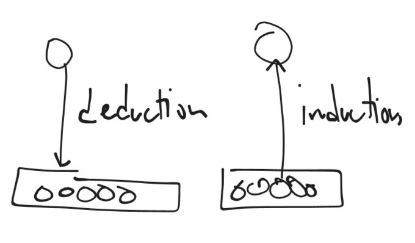

# LEC1

Case study number 1 
Global finalcial crysys
Grate Recession 11 12 
- Down turn in livig standarts accros the world Power parity!
- Housing Market 

Increasing realeace in dept to buy money
-> human irrational behaviour

Sociologos is part of a larget set of social sciences
-> human behaviur in a collective context 
-> Its a critique (opposite) Neoclassical economics (By and large 
consumers (human actors) tend to act in logica way)

Neoclasscial enconmics is infulental in politioncs cause this is 
where they take the politcies from 
We goa conclue this is false beacuse humand are stupid and we tend 
make stupdi jokes -> cant be fully rational

### Peer presure - ???

- Second case study the israely palestinian conflict 

Terrorrism - use and thread of violance ...???

# LEC2 
continues form previous

Global Financila Crises (2008 = 2012)

The basic GDP expenditure formula is:

$$
GDP = C + I + G + (X - M)
$$

* **C** = Consumption (private spending by households)
* **I** = Investment
* **G** = Government spending
* **X - M** = Net exports (exports − imports)

So GDP = **C + I** only if you assume no government spending and no trade.

Do you want me to show you a simplified case where GDP = C + I?

2% - healthy 

to -> 0% a luming recession

rising tide reasses all the boats -> fails to translate to real world

wage -> money only
salary -> money + benifits 

### GINI index := measuere of the income inequality 
italian social science 

if in a given group
0 - everyone  if everone earn the same income
1 - in a given econome one individual earn all income
0.25 - 0.30 - this is where it stood noramally
but then there is a rise 
Brazil 200 million -> 5-10 million liven standarts to westian EU

wellfare are social democratic states  (Skandinavie, norway, sweedem, findland, ...)
part of the potical process was to minimize the income inequality

### THe reverse curve Manufac vs Finance (DeInduistralisation) -> labor coust
manufacturing -> producntion of physical goods
finace -> things have to do with money

#### mortgage -> moeny (lent) + collateral (valuable asset)

DEPT:
- Household 
- Corporate 
- Goverment

- Demand 
- supply 
company wasnts to increate the profit but wages are not so as acompnay we want 
the consumers to go into dept

- own 
- rent
500,000 EU downpainment 100,000 EU 400,000 EU lent
20 years

hedge  themself from their clietns turning insolvent

The colletaral is the familay house for te purses of which i took out the lone
if i go backrouut.
If i take the housein mortgage and i cant keep up with the morgage -> 
to be forclosed 
forclosure

In EU they have to start a legal case in court -> only when the court rulses 
againt you they can stort teh forclosing
In US if you miss three they literally kick you

for forclosure it doesnt have ot be the hosue

forclosure the landing instuution takes back the collateral;
For a home or real estate: "In a foreclosure, the lending institution forecloses on the collateral."
For any collateral (general term): "In a foreclosure action, the lending institution seizes the collateral."

Union is an organizaiont who represent the employies

### Lec2  
A critique of Neoclassical economics;
DeInduistralisation 
-> Labor cost 
-> Less worker protected

"blue color" -> physical jobs
"white collor" -> whitecolor workers

deregulation -> more like reregulation
Ficticus

interest rate 2% -> 10 % 0.1% 

going public, shares introduced in stock Market

in old bvaking paradime the bakers are prohibiteed to borrwo in deposoted savings

The Glass -Stegall Act -> co sponsopred the bill  (1933)
1. Retail banking  (daily basses Bank stuff apply for morgaces open bank account ..)
-------                -> set up frewall 
2. Investmetn banking (making large scale investments, financin abisous product)
-------
3. Insurace industry (protecting agains the rist) 

why insurace and retail
Derivative 

500k $ morgage

sell outstanding dept to third parites

Rating agencies rate tehe credit worthness, investment wrothnes

S&P, Fitch, Moody's

## Lec3
Advertising si the par of making people **spent money they 
don't have**[1] to **buy things they don't need**[2] in order to 
**impress people they dont care about**[3].

Securitizaion food change

Old days: Morgages took decades to apy 

lender sold the morgages (outsending dept) 
to invesments bandk who created complex derivatives
(CDO's) sell to invectors
Rating agencies triple AAA ratings

subprime morgate 

subprime -> variable intersetrate
$1000 interest 5% 
6400.000 => 1%
peg(ged) -> stoced market index

if a log of 

monthly depped service
SEC := security and exchange commision

leverage ratio

bail out 

bail out (verbal)
bailout (noun) => 

"neoclassicist pure abstract"
there is no free lunch

"market economy innamagible"

unconditional

### Neoclassical economic theory is
1. a deductivist epistemology (theroy of knowledge)
prefering mathematical formalisation 
or unrealistic assumptions

Deductions 
- start from assumtions
mean exaplainng the state of affares with respect to you 
inverifed assumtions

Or natural sciences are based in induction
from the world you try to conclude what should happen

Deduction in neoclassicist economis: 
- we are perfect logical beings
- all infromation avalible
are unrealistic assumtions

2. intellectualist philosophy 
backed in the idea of **complete awareness**

3. an **atomistic** pr **discontinuist** 
view of the social world

it glosses over collective behaviour 
the BONDS (fashion, trendin stufu and ***POLITICAL POWER***)

### Questions
there are savign (bailing out) the invectors
In essay should we write:
- You like examples a lot

